# de:code 2019 パーソナル スポンサー コード サンプル: Microsoft Graph の変更通知を使ったユーザーのプロビジョニング

FIM/MIM などの従来の Identity Management ツールでは実現が難しい、Office 365 との連携について、Microsoft Graph を使って実現する方法について説明します。Microsoft Graph と Azure Functions を使って、Office 365 (Azure Active Directory) に新しいユーザーが追加されたときに、Outlook の予定表に新しい予定を追加したり、Microsoft Teams のメンバーに追加するといった、プロビジョニングの自動化を行います。

## 概要

Microsoft Graph では変更を検知する手段として 2 つの方法が提供されています。pull 型の変更検知としては[デルタ クエリ](https://docs.microsoft.com/ja-jp/graph/delta-query-overview)、push 型の変更検知しては[サブスクリプション](https://docs.microsoft.com/ja-jp/graph/webhooks) (webhook) があります。今回は Azure Functions のタイマー トリガーを使って、定期的にデルタ クエリを発行し、新しく追加されたユーザーを対象にプロビジョニングを行います。

## サンプル コード

### 開発環境

- Visual Studio 2019
  - Azure Functions をデプロイするため \[Azure の開発\] のワークロードを有効にする必要があります。

### NuGet パッケージ

- Microsoft.Extensions.Configuration.EnvironmentVariables
  - 環境変数を読み込むためのライブラリです。Azure Functions ではアプリケーションの設定情報はすべて環境変数として渡されます。これらの値を安全に読み込むために使用します。
- Microsoft.Graph
  - Microsoft Graph を実行するためのライブラリです。Microsoft Graph は RESTful なサービスなので、HTTP クライアントで直接呼び出して開発することもできますが、ライブラリを使用することで、開発生産性を高めることができます。
- Microsoft.Identity.Client
  - Microsoft Authentication Library (MSAL) と呼ばれるライブラリです。Azure Active Directory に対して OAuth2 によるアクセス許可を行うために使用します。

### 動作説明

プログラムは Azure Functions のタイマー トリガーで起動します。今回はサンプルのため 10 分間隔で実行するように設定しています。実際の運用ではそこまで頻繁に実行する必要はなく、個々の環境にもよりますが、一般的には日次で実行するのが妥当でしょう。

プログラムは起動されると、最初に環境変数で渡された情報をもとに Azure Active Directory に対して OAuth (Client Credentials Grant) による認可を行います。認可が正しく行われると Azure Active Directory から Access Token が取得できますので、これを Microsoft Graph への HTTP アクセスの Authentication ヘッダーに設定します。

初回実行時と次回以降の実行を判断するために Azure Blob Storage にファイルが存在するかどうかを確認します。このファイルにはデルタ リンクと呼ばれる次回以降の増分のユーザー情報を取得するための URL が格納されています。ファイルがない場合は初回実行と判断し、これまでのすべての増分のユーザー情報を取得します。ファイルがある場合は、デルタ リンクの URL からの増分のユーザー情報を取得します。なお、増分はページングによって返却されるため、すべてのデータが取得できるまでループします。

増分のユーザー情報には変更や削除の場合も含まれます。変更や削除の場合は @removed プロパティが含まれるため、@removed プロパティが含まれるユーザー情報を除外します。また、取得したユーザーには Office 365 のライセンスが付与されていないユーザーが含まれている場合があるため、ライセンスの詳細を取得し、Microsoft Teams および Exchange Online (Plan1) または Exchange Online (Plan2) のプランを付与されているユーザー情報のみを抽出します。

抽出したユーザーに対して以下の操作を行います。

- Microsoft Teams のメンバーに追加します。Microsoft Teams のメンバーは Office 365 グループ、つまり Azure Active Directory のセキュリティ グループであるため、対象のセキュリティ グループのメンバーに追加することで実現します。
- ユーザーに会議出席依頼を送付します。今回は 2 日後の 9 時から 18 時 (日本標準時) で予定を作成していますが、実際の運用では、土日や祝日を考慮する必要があります。

最後に、前述したデルタ リンクの URL を Azure Blob Storage に保存します。

## デプロイ手順

- [Azure Active Directory へのアプリケーションの登録](#Azure-Active-Directory-へのアプリケーションの登録)
- [ユーザー ID および グループ ID の取得](#ユーザー-ID-および-グループ-ID-の取得)
- [Azure Functions のデプロイ](#Azure-Functions-のデプロイ)
- [Azure Functions のアプリケーション設定の変更](#Azure-Functions-のアプリケーション設定の変更)

### Azure Active Directory へのアプリケーションの登録

1. [Microsoft Azure Portal](https://portal.azure.com) にログインします。

1. \[Azure Active Directory\] - \[アプリの登録\] - \[新規登録\] の順にクリックします。
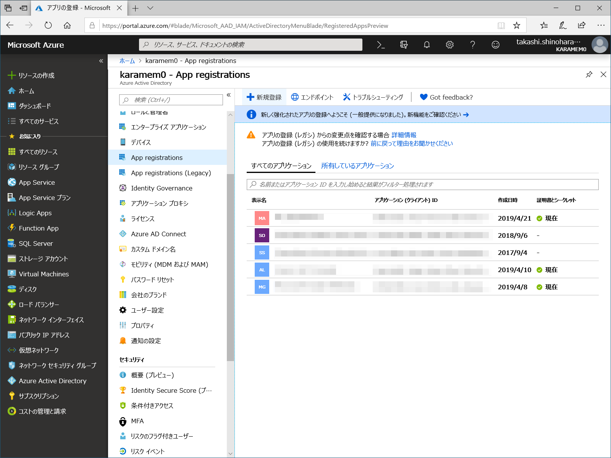

1. アプリケーションの情報を入力して \[登録\] をクリックします。

1. \[概要\] で `アプリケーション (クライアント) ID` および `ディレクトリ (テナント) ID` の値をメモ帳などにコピーして保存します。
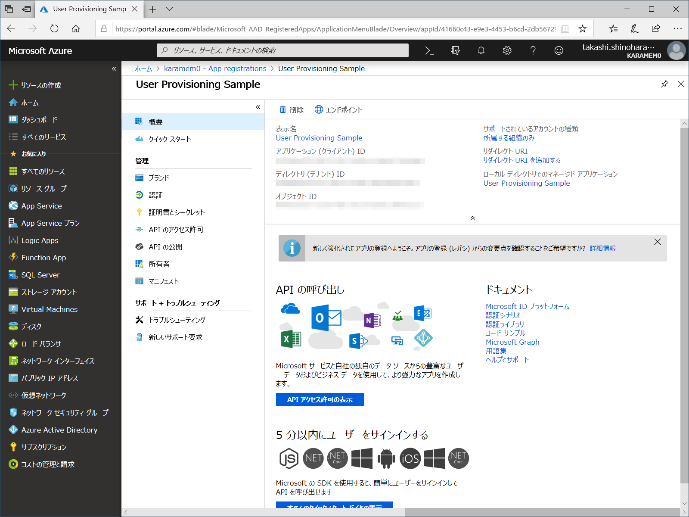

1. \[認証\] - \[リダイレクト URL\] で `https://login.microsoftonline.com/common/oauth2/nativeclient` を選択し \[保存\] をクリックします。

1. \[証明書とシークレット\] - \[新しいクライアント シークレット\] の順にクリックします。

1. \[追加\] をクリックします。

1. 作成された `クライアント シークレット` の値をメモ帳などにコピーして保存します。

1. \[API のアクセス許可] - \[アクセス許可の追加\] の順にクリックします。
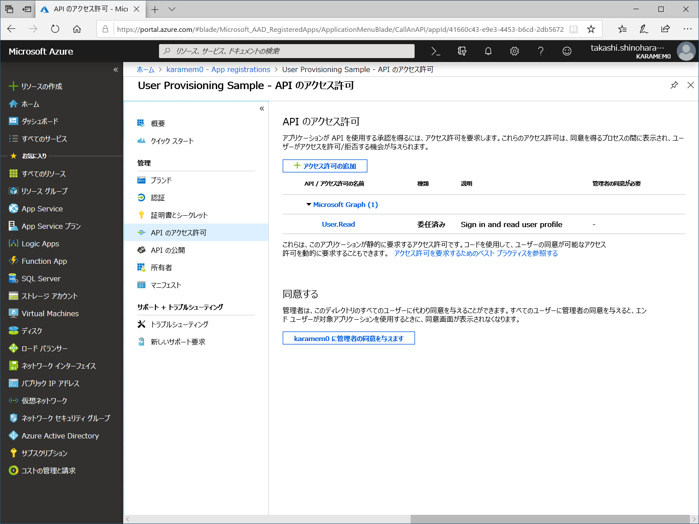

1. \[Microsoft Graph\] をクリックします。

1. \[アプリケーションのアクセス許可\] を選択します。
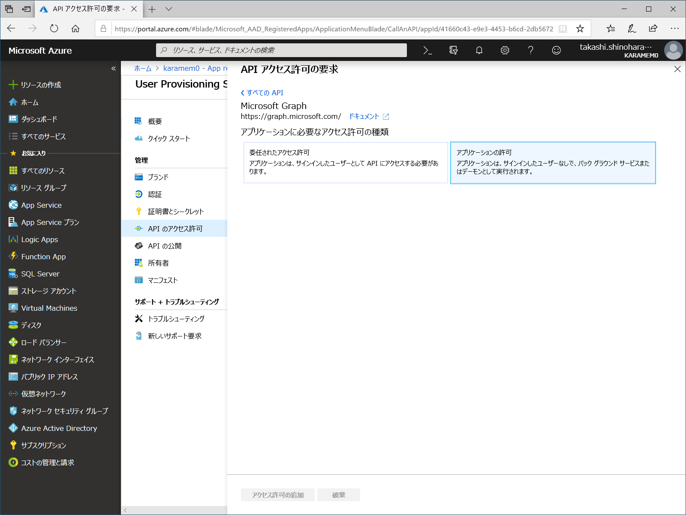

1. `Calendars.ReadWrite`、`Group.ReadWrite.All` および `User.Read.All` を選択して \[アクセス許可の追加\] をクリックします。

1. \[`ディレクトリ名` に管理者の同意を与えます\] をクリックします。
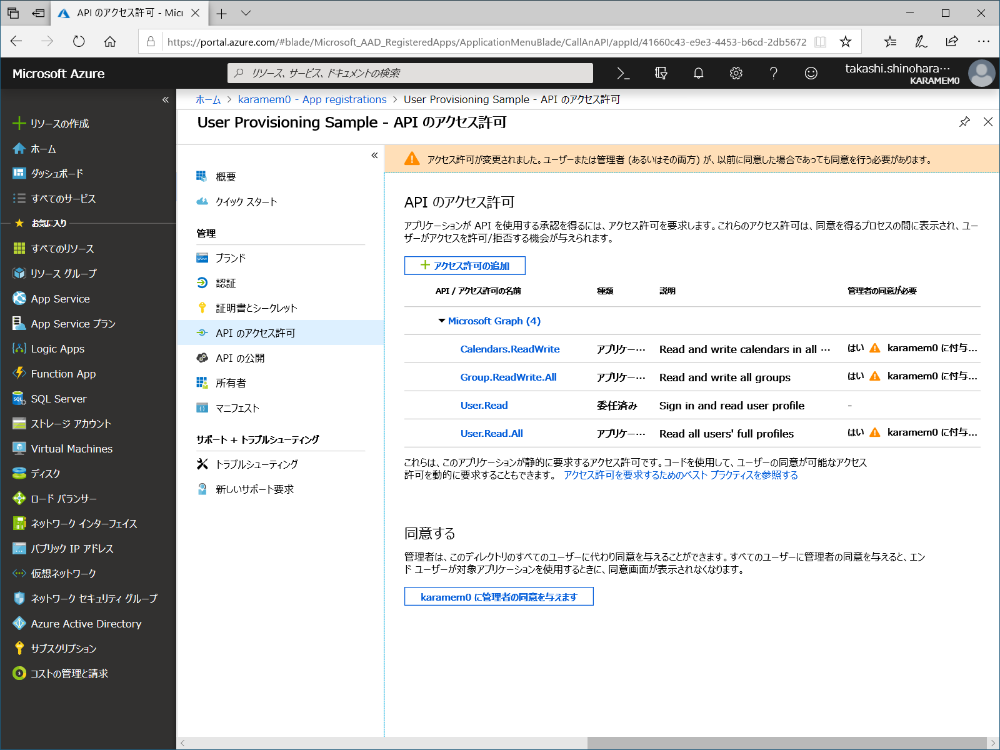

1. \[はい\] をクリックします。

### ユーザー ID および グループ ID の取得

1. [Graph エクスプローラー](https://developer.microsoft.com/ja-jp/graph/graph-explorer) を開きます。
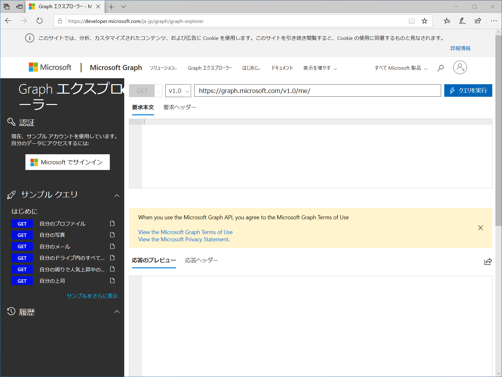

1. \[Microsoft でサインイン\] をクリックします。サインイン情報を求められるので、組織アカウントの資格情報を入力します。このアカウントは会議出席依頼の開催者となります。
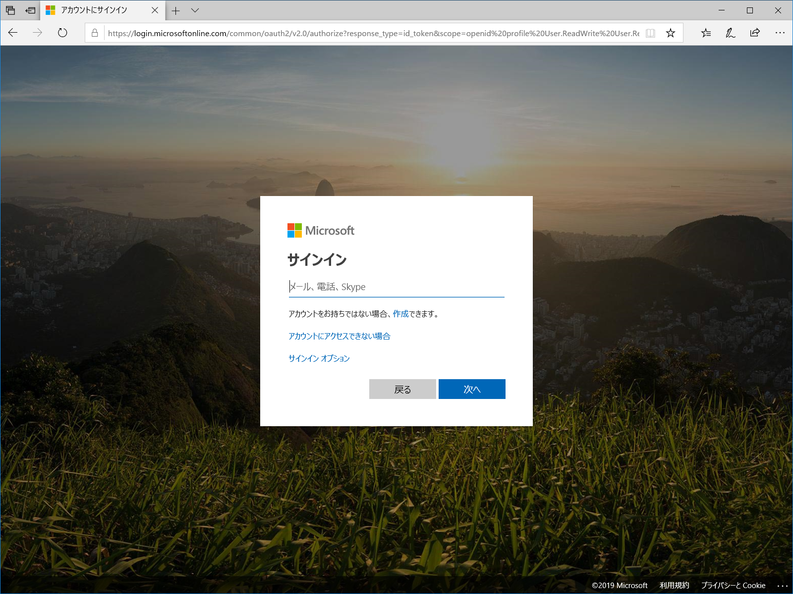

1. `https://graph.microsoft.com/v1.0/me/` を実行します。応答の JSON の id プロパティ (`ユーザー ID`) の値をメモ帳などにコピーして保存します。
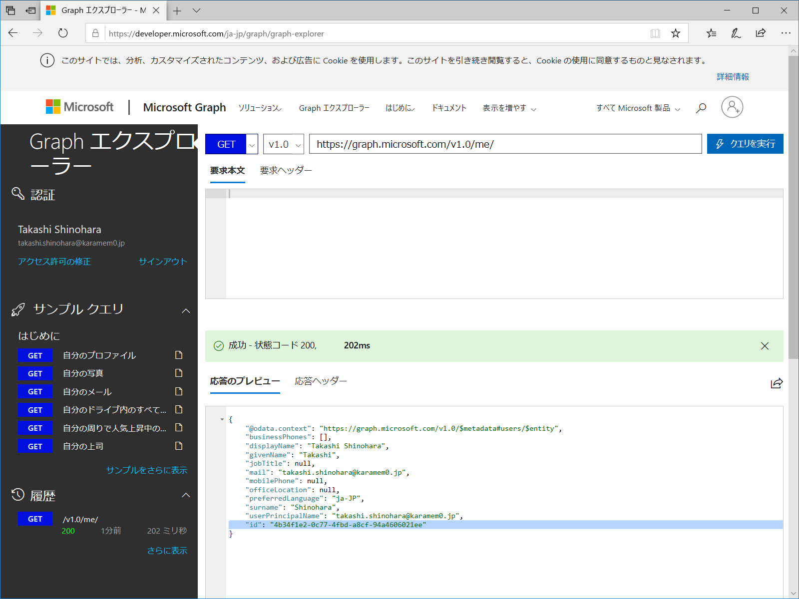

1. \[アクセス許可の修正\] をクリックします。`Group.Read.All` を選択し \[アクセス許可の修正\] をクリックします。

1. `https://graph.microsoft.com/v1.0/groups/` を実行します。応答の JSON から Microsoft Teams のグループを探し、id プロパティ (`グループ ID`) の値をメモ帳などにコピーして保存します。

### Azure Functions のデプロイ

1. Visual Studio で \[UserProvisioningSample.sln\] を開きます。

1. \[ビルド\] - \[UserProvisioningSample の発行\] の順にクリックします。

1. \[発行先を選択\] で \[新規選択\] を選択し \[発行\] をクリックします。
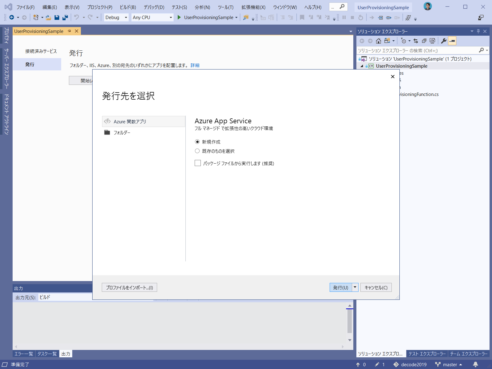

1. \[新規作成\] でデプロイするリソースの情報を入力して \[作成\] をクリックします。
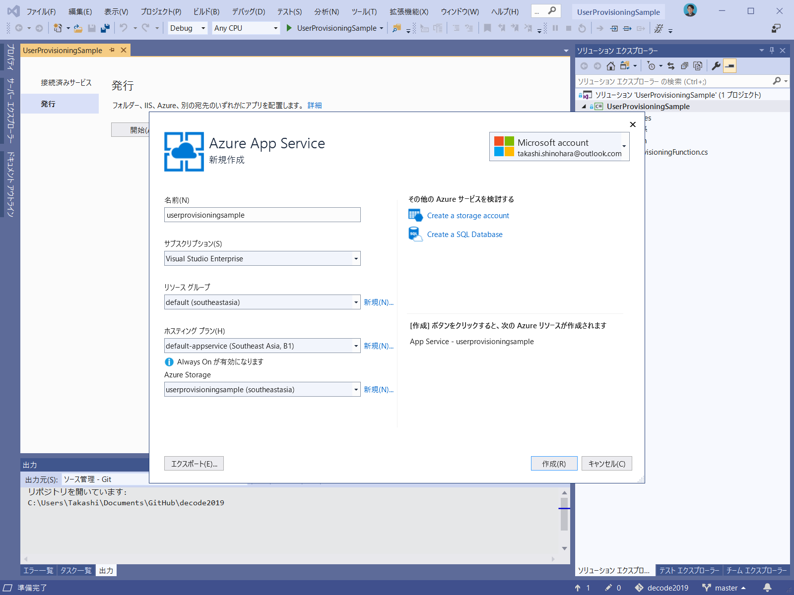

### Azure Functions のアプリケーション設定の変更

1. [Microsoft Azure Portal](https://portal.azure.com) にログインします。

1. \[Function App\] - \[`デプロイしたリソースの名前`\] の順にクリックします。
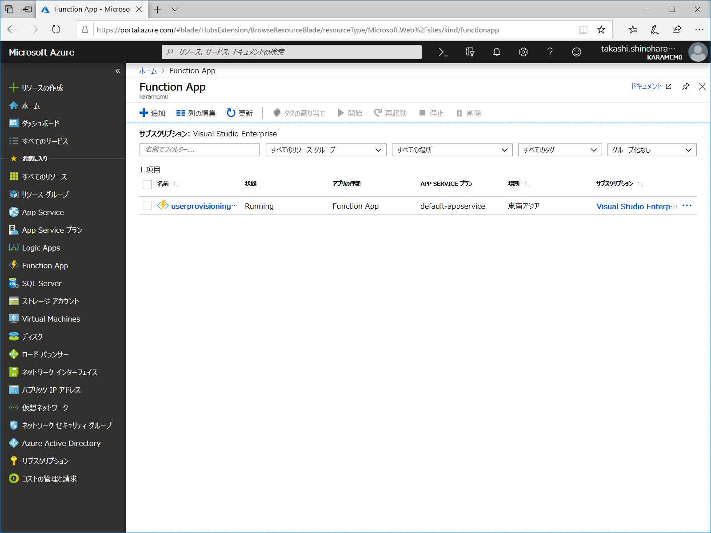

1. \[概要] - \[構成済みの機能\] - \[アプリケーション設定\] をクリックします。
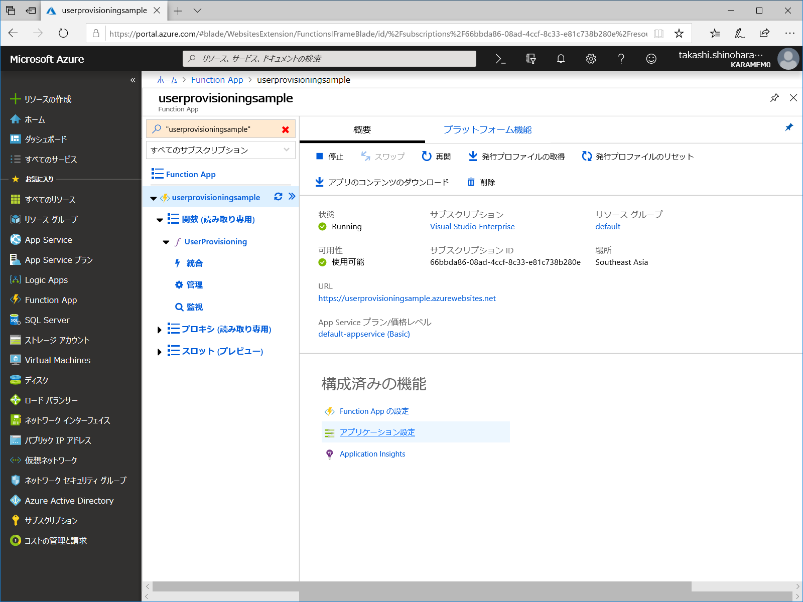

1. \[Application Settings\] に以下のアプリケーション設定情報を追加し \[Save\] をクリックします。
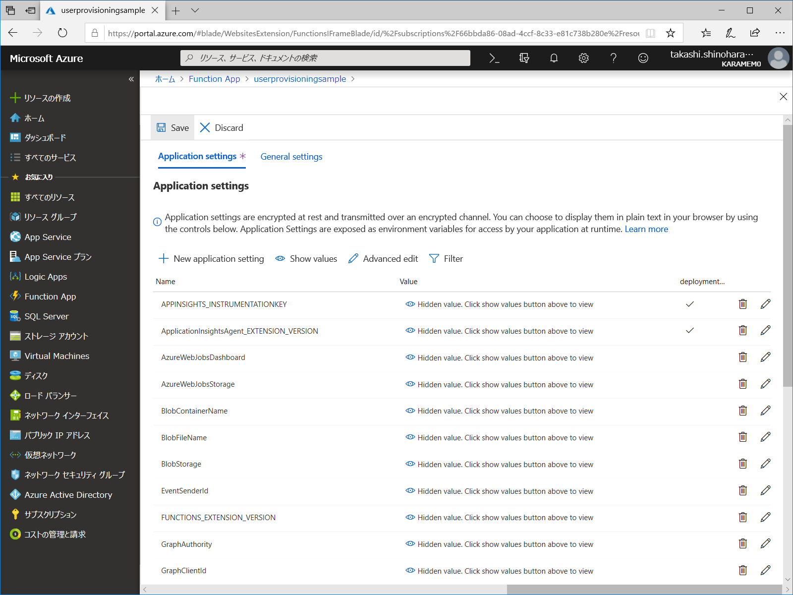

| 名前 | 値 |
| --- | --- |
| GraphTenantId | [Azure Active Directory へのアプリケーションの登録](#Azure-Active-Directory-へのアプリケーションの登録)で取得した `ディレクトリ (テナント) ID` の値 |
| GraphAuthority | `https://login.microsoftonline.com` |
| GraphClientId | [Azure Active Directory へのアプリケーションの登録](#Azure-Active-Directory-へのアプリケーションの登録)で取得した `アプリケーション (クライアント) ID` の値 |
| GraphClientSecret | [Azure Active Directory へのアプリケーションの登録](#Azure-Active-Directory-へのアプリケーションの登録)で取得した `クライアント シークレット` の値 |
| GraphRedirectUrl | `https://login.microsoftonline.com/common/oauth2/nativeclient` |
| GraphScope | `https://graph.microsoft.com/.default` |
| BlobStorage | アプリケーション設定 `AzureWebJobsStorage` の値をコピー |
| BlobContainerName | `graph-subscription` |
| BlobFileName | `deltalink` |
| TeamsGroupId | [ユーザー ID および グループ ID の取得](#ユーザー-ID-および-グループ-ID-の取得)で取得した `グループ ID` の値 |
| EventSenderId | [ユーザー ID および グループ ID の取得](#ユーザー-ID-および-グループ-ID-の取得)で取得した `ユーザー ID` の値 |
